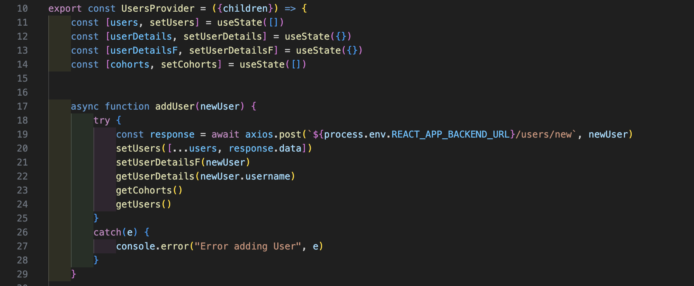

# Project Three - Crash Course Collective
Table of Contents:
+ Project Overview
+ Deployment Link
+ Getting Started/ Code Installation
+ Timeframe & Working Team
+ Technologies Used
+ The Brief
+ Planning
+ Build Process
+ Challenges
+ Wins
+ Key Learnings
+ Bugs
+ Future Improvements

## Project Overview

### Project 3: Crash Course Collective


Crash Course Collective is a community where users can view profiles and projects from their fellow students in their course cohort, and past alumni. Using a GitHub API for login authentication, as a team of three we created a full-stack CRUD application using JavaScript, MongoDB, Express, React.js and Node.js.

CCC was born out of our desire of being able to view past student’s work easily who had been in the same bootcamp as us. Using this app, users are able to add themselves to a cohort, edit their profile and add projects to their ‘portfolio’.

## Find the completed project here: [Crash Course Collective](https://crashcoursecollective.netlify.app/)

## Getting Started/ Code Installation

[GitHub Front End](https://github.com/JoelleLi/Unit3_Project_CrashCourseCollective_Frontend)

[GitHub Back End](https://github.com/JoelleLi/Unit3_Project_CrashCourseCollective_Backend)

Clone / download the repo.

In terminal run the following commands:

+ Install dependencies ```npm i```
+ In back-end folder, start the server using ```nodemon```
+ In front-end folder, start the server using ```npm run start```

## Timeframe & Working Team

**Team of 3, 7 days**

My primary role was to implement the front and back end CRUD functionality of the User model.

**Collaborators:**

**Cameron Orr** | [GitHub](https://github.com/KiwiCJ/Project-2-Frontend)

**Toby Kittow** | [GitHub](https://github.com/TKittow/Unit2_Project_Frontend)

## Technologies Used

**Backend**
+ MongoDB
+ Express
+ JavaScript

**Frontend**
+ React.js
+ JavaScript
+ Node.js
+ Axios
+ Bootstrap
+ HTML 
+ CSS

**Development Tools**
+ VS Code
+ Google Chrome Dev Tools
+ Git
+ GitHub
+ npm
+ Netlify (deployment)
+ Excalidraw

## Brief

+ **In a team, create a working full-stack, single-page application** hosted on Netlify.
+ **Incorporate the technologies of the MERN-stack**: MongoDB, Express, React and Node.
+ **Have a well-styled interactive front-end** which communicates with the Express backend via Axios.
+ **Implement token-based authentication**, including the ability of a user to sign up, log in and log out.
+ **Implement authorization** by restricting CRUD data functionality to authenticated users.
+ Navigation should respond to the login status of the user.
+ Have a well-scoped feature-set. 
+ Optionally consume data from a third-party API.

## Planning

As a team, we first used a live Excalidraw to agree together what our initial plan of action would be, the minimum features the app would have and the order of steps we needed to take.

We drew up plans for the UI of how we wanted the user story to play out, and how data would be displayed for the user. This helped us to determine what our data entities would contain.


We created an ERD on LucidChart with our minimum requirements of what the User, Project and Cohort model should contain. From the GitHub API documentation, we determined what information we could pull from the data response after a user logged in with GitHub.


## Build/Code Process

### Day 1 
We spent the day planning and delegating tasks evenly to all members of the team. I got the User and Cohort schemas stubbed up, and began to create a basic navbar in the frontend UI.

As we wanted to use a GitHub API to create the user model, we had to implement this first so that we could pull data from it. For me, this was the first small hiccup as working part of a team as we needed to get this done first in order to get started on a lot of the functionality that relied on that data. However it did not make sense for more than one person to work on it, so I found it difficult to find other things to work on during this time.

However, once this was done I was able to work on the logging in functionality which would pull the data from the response from GitHub to actually create a User in the database.

### Day 2

Today I finished implementing creating a user in the database automatically when logging in with GitHub. At first, I decided to pass the bare minimum amount of data (username, gitUrl and userAvatar), and then add more data fields later once I had got it working.


After logging in, the backend would check if there was already an existing user with that username. If not, a new User would be created. If there was already one existing, that User would be updated with the latest information from the GitHub API. Therefore, if the user was to update their avatar on GitHub, after logging out and in again on the app, their avatar would also update there.


I was responsible for ensuring the User details were accessible throughout the app on the front end. The log in function would automatically pass the GitHub data to User Context, either creating a new User or fetching the existing User’s information and setting it as state.



### Day 3

This was my first project using a Context Provider, and found the process a real learning curve. I decided to use context so that the user information would be readily available throughout the application. However, when trying to edit a user profile on the front end by accessing the context, I hit a massive blocker where I could not access the data as it was ‘undefined’ after navigating to the ‘edit profile’ page.
After a lot of trying to problem solve and trying to work out why state could not be accessed from the edit profile page, it turned out to be quite a simple solution.

The problem stemmed from the Bootstrap Navbar template I had used, which had an ‘href’ tag on each link to each page. The href was refreshing the page when clicked, therefore losing any state that had been stored.

As this was my first project using both state and Bootstrap, it felt like a lot of time had been wasted trying to solve the problem, but also a mistake I will definitely never make again.

I managed to finish a functioning basic edit profile form in the front end and back end.

### Day 4

I started to try and implement a drop down box in the edit profile form in which the user could choose their cohort. Choosing a new cohort would delete the user from the previous one, and add the user to the new one.

As a team we decided that we would pre-load a choice of cohorts to the Cohort schema, as we thought that if users could add their own cohorts it would start to get complicated. We started off with a choice of three cohorts: GA-SEB-76, 77 and 78.


Once the profile edit form was submitted in the front end, if the cohort was changed, the back would update the cohort the User belonged to, and delete them from their previous one. 

### Day 5

After getting the core functionality and CRUD aspect of the User profile done, I began to work on the styling and how this data would be displayed.

Using a mixture of Bootstrap classes and vanilla CSS, I created a simple user interface ensuring that data such as GitHub and LinkedIn links were displayed clearly.


After originally using a Bootstrap template for the Navbar, I decided to remove the Bootstrap classes and create one from scratch instead.

I did however keep the dropdown from the original Navbar, using it to house the My Profile, Edit Profile, My Cohort, and Logout links.

### Day 6 

I worked on the styling of the Project page and tried to find a way to display visuals of the project. 

Originally we considered having a carousel of images of the deployed project on each Project page, but at this point of the course our knowledge was limited to only being able to upload and display URLs of images. However, as a team we decided this would not be an ideal user experience.

I researched ways in which each ProjectCard on the homepage could display an image of the deployed project without the User having to upload URLs. I at first looked into using iFrames, but this did not work well with projects such as games with animations or music/ sounds which would automatically start as soon as the page loaded.

I then looked into a screenshot API which would take an automatic screenshot of the landing page of a URL. However these involved usage fees over a certain limit which I was quite wary about, due to the team running into quite a few infinite loops over the course of the project process.

As a team we settled on uploading a single URL that the user would want as their cover image for the Project Card. Then the actual Project page would contain an iFrame of the deployed website.

### Day 7

Most of today was spent refining the UI of the application as a whole, in particular displaying the Project cards on the homepage in a way which was clear. We wanted the Project card to display the user’s avatar, whether the project was group or solo, and any collaborators who also worked on it. 
Seeing as this was quite a lot of information to display, I worked on a way of making the card expand in size and the information disappear when the cards are hovered over, so that the snapshot image is more clear.

The project was then deployed on Netflify. This was my first time using the npm run build command, and I was surprised to learn that a lot of unused code would cause the deployment to fail. 

## Challenges

This was my first time working in a team on a coding project, and I found many aspects of it difficult at first. At the beginning it was difficult to delegate work when one task relied on another person completing another task first. By the end of the project, in hindsight there were actually quite a few things we could have worked on whilst we were waiting for other tasks to be completed.

Throughout the project, as a team we were on a constant Zoom call so that we could talk to each other all the time about any issues we were facing. However, this could be quite distracting. In terms of time management, I do think that we might have worked much better if we had one team meeting in the morning to discuss our goals for the day, and then worked individually on the delegated tasks. 

Overall, working in a team was a fantastic experience and really helped me to improve my time management and collaborative skills. 

Getting used to using state and context was a great challenge for me, but one that I’ve learned so much from. The massive blocker I had with the href in the Bootstrap form refreshing the page and losing all stored state was frustrating at the time, but also a relief to find out it was a very simple solution.

## Wins

I think that the visual design of the application is really strong. Considering there may be conflicting views in a team, we worked well together in agreeing on what we wanted the styling to look like and how data would be displayed.

Having coded one project before using Vue.js, which I found a difficult learning process, using React.js for this project really helped me to build on that knowledge and experience of passing data between front and back end. When working on the User edit functionality, during this process I felt that I was finally understanding how things fit together. This project helped me gain so much confidence in my own problem solving abilities.

As a team, I think we were really successful in delivering our project. We worked really well together, and as a person who enjoys working individually, I loved the daily interaction with my team and having others to bounce ideas off and help problem solve. The whole experience has given me a lot more confidence in approaching collaborative projects.

## Key Learnings/Takeaways

From working with my team daily and getting used to the constant interaction, I became so much more confident with stand ups and showcasing my work, as well as giving and receiving constructive feedback.

Using React.js for this project, I have loved the experience and really felt I had an ‘aha’ moment when using it when everything really started to come together. I now feel quite confident in building a full-stack CRUD application, as a team and individually.

In terms of project management, this project has really helped me to think about work delegation and the importance of planning and organisation, especially when working in a team.

## Bugs

At the moment, when not logged in the Cohorts page does not show any students.

## Future Improvements

I would like to implement an image upload feature, so users can upload a collection of images to display in the Project page.

To give the app more of a community feel, I would like to add a ‘like’ button to each project.

Give users the ability to edit a Project which they have been added as a collaborator on, but they did not create the original Project post.
Allow students from other courses and organisations to add themselves to their cohort.
